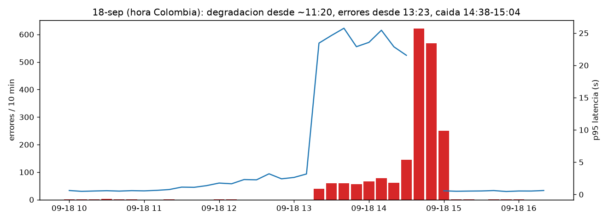
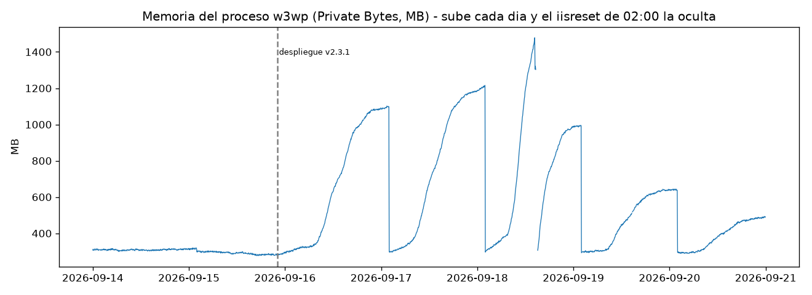

# Post-mortem: caída de PortalPagos, viernes 18 de septiembre de 2026

**Elaborado por:** Fabián Pinzón · **Enfoque:** sin culpables · **Horas:** Colombia (UTC-5)

> **En una frase:** una actualización del martes 15 trajo una fuga de memoria; el reinicio nocturno de IIS la escondió dos días y el viernes, con el pico del cierre de pagos, tumbó el portal. El monitoreo no lo vio porque mide si el servidor responde, no si los clientes pueden pagar.

## 1. Resumen para la Dirección

El viernes 18, último día de plazo de pago, el portal se puso lento desde las **11:20**, empezó a fallar al confirmar pagos a las **13:23** y estuvo **caído de 14:38 a 15:04** (26 min). Fallaron cerca de **2.000 operaciones**, entre ellas **250 confirmaciones y 254 inicios de pago**.

**Causa:** la versión 2.3.1 del portal trae un componente que acumula memoria y no la libera. El `iisreset` de cada madrugada lo ocultaba; el viernes llegó 1,5 veces el tráfico normal y la memoria se agotó a media tarde.

**Por qué nos enteramos por los clientes:** el NOC solo verifica que el servidor responda. En su revisión semanal reportó "/health OK 100 %, sin novedades" (T-10270).

**Riesgo vigente:** la fuga sigue en producción y el disco del servidor se llena alrededor del **martes 22**.

## 2. Impacto

| Indicador | Valor |
|---|---|
| Lento / errores al pagar / caído | 11:20–15:04 (3 h 44 min) / 13:23–15:04 / 14:38–15:04 (26 min) |
| Operaciones fallidas el 18 | ~1.985 (496 errores de la aplicación + 1.489 rechazos con el portal apagado) |
| Disponibilidad real viernes / semana | **94,5 %** (92,7 % exigiendo respuesta < 3 s) / 98,6 % |
| Disponibilidad reportada por el NOC | 100 % |
| Reintentos de confirmación | ~630 de más (1,01 confirmaciones por pago iniciado, frente a ~0,84 normal) |

## 3. Línea de tiempo

| Hora | Qué pasó | Qué vio el cliente | Evidencia |
|---|---|---|---|
| Mar 15, 22:03 | Se instala la v2.3.1 (caché de sesiones de pago, logs en Debug) | Nada | AndinaDeploy 1000 |
| Mié 16 – jue 17 | La memoria sube a 1,1–1,2 GB y el reinicio de 02:00 la baja | Lentitud el jueves (T-10240, cerrado "monitoreo en verde") | Perfmon |
| **Vie 11:20** | Degradación: p95 pasa de 0,5 s a 1–3 s | Lentitud | Logs IIS |
| **13:23** | Primer error al confirmar pago (falta de memoria) | "Error inesperado" (T-10252) | IIS, ASP.NET 1309 |
| 14:22–14:38 | El proceso del portal se cae 5 veces | Errores intermitentes | .NET 1026, WAS 5011 |
| **14:38** | IIS apaga el pool por fallas repetidas | "Service Unavailable" (T-10255) | WAS 5002, HTTP.sys |
| **15:04** | Reinicio manual del pool | Servicio normal | Último 503: 15:03:59 |

_Fuentes (carpeta `kit/`): IIS = `logs/iis/W3SVC2/u_ex260915.log` a `u_ex260918.log`; HTTP.sys = `logs/httperr/httperr1.log`; eventos (AndinaDeploy, ASP.NET, .NET, WAS) = `eventos/eventos_WEB-PAGOS-01.csv`; memoria y disco = `metricas/perfmon_WEB-PAGOS-01.csv`; tickets = `tickets/tickets_mesa_servicio.csv`. Cada hora sale de `analizar.py` (funciones `hitos`, `linea_tiempo` y `eventos_clave`) y queda en `resultados/`._

## 4. Causa raíz

**Comprobado con los datos:**
- Todos los errores son `OutOfMemoryException` en `SesionPagoCache.Agregar`, componente que llegó con la v2.3.1.
- Memoria máxima diaria: ~320 MB antes de la actualización; 1.091, 1.186 y 1.478 MB el 16, 17 y 18.
- Crece con los pagos: correlación horaria de **0,993** (~0,25 MB por operación). El error llegó tras ~4.200 operaciones de pago desde el reinicio de 02:00.

**Hipótesis por confirmar:** el caché no expulsa sesiones antiguas. Un `OutOfMemoryException` sale donde falla la asignación, no necesariamente donde está la fuga; se confirma analizando los 5 volcados de memoria (`C:\CrashDumps`). El portal cae cerca de 1,4 GB con 4,7 GB libres en el servidor, lo que sugiere un pool en 32 bits (`enable32BitAppOnWindows`).

**Descartado:** DCOM 10016 (T-10261), constante toda la semana; y el retiro de D: o el proxy del 16, porque la memoria ya subía desde las 07:00, antes de ambos cambios.

## 5. Por qué llegó a los clientes y cuándo se pudo ver

1. El reinicio nocturno de IIS escondió la falla dos días.
2. `/health` responde en 2 ms aunque pagar tarde 25 s, y sus 52 fallos quedaron en un log que nadie revisa (HTTP.sys).
3. El ticket del jueves por lentitud se cerró por "monitoreo en verde".
4. Cambios sin seguimiento: sin revisión post-despliegue, y un aparente proxy nuevo desde el 16 sin evento ni ticket.

Simulando alertas sobre los mismos datos: **memoria > 1 GB** habría avisado el miércoles 16 a las 18:40 (casi dos días antes); **latencia > 2 veces lo normal por 15 min**, el viernes a las **12:00**, 1 h 34 min antes del primer ticket y sin falsas alarmas de lunes a jueves.

## 6. Otros riesgos

| Riesgo | Urgencia | Detalle |
|---|---|---|
| Disco C: lleno | Crítica | ~240 MB por cada 1.000 peticiones; con 10,9 GB libres se llena el martes 22. Una nueva caída lo llena en horas (volcados) |
| Fuga en producción | Crítica | El portal aguanta ~4.200 operaciones de pago al día |
| Cobros duplicados | Alta | Verificar que `/api/pagos/confirmar` sea idempotente y cruzar con el sistema de pagos |
| Auditoría sin copiar desde el 16 | Alta | El script apunta a D:, retirada ese día, y dice "Proceso OK" |
| Contraseña en texto plano | Media | Cuenta de servicio en el script de mantenimiento |

## 7. Acciones recomendadas

| Acción | Para qué | Plazo |
|---|---|---|
| Mover los volcados de memoria, liberar disco y bajar logs a Information | Contener | Inmediato |
| Volver a v2.3.0 o poner límite y expiración al caché | Corregir | Antes del próximo cierre |
| Reciclar el pool por umbral de memoria (red temporal) | Contener | Esta semana |
| Health check transaccional, monitoreo sintético y alertas de errores, p95, memoria y disco | Detectar | 2 semanas |
| Revisión 24 h post-despliegue, registro de cambios, nuevo script de mantenimiento y rotación de la clave | Prevenir | 1 mes |

_Cifras reproducibles con `python analizar.py`; detalle en `resultados/`._
