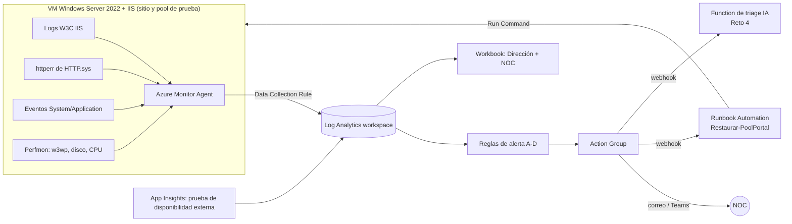

# Reto 3 · Observabilidad y auto-remediación en Azure (diseño)

> **Estado honesto:** por tiempo, este reto se entrega como **diseño detallado y artefactos listos para desplegar** (consultas KQL, reglas de alerta y runbook), no como un entorno montado con capturas. Prioricé entregar bien probados los Retos 1, 2 y 4, como pide la prueba. Lo que sí está validado: **los umbrales de las alertas se probaron contra los datos reales del kit** (Reto 1, `analisis_avanzado.md`). La suscripción de Azure y el presupuesto con alerta (USD 10, avisos al 50 % y 90 %) quedaron creados.

## 1. Arquitectura

## 2. Recolección (Azure Monitor Agent + Data Collection Rule)

| Fuente | Configuración en la DCR | Tabla destino | Por qué |
|---|---|---|---|
| Logs IIS W3C | Origen "IIS logs" | `W3CIISLog` | Errores, latencia, tráfico por endpoint |
| **Log de HTTP.sys** (`C:\Windows\System32\LogFiles\HTTPERR\*.log`) | Origen "Custom text logs" con transformación KQL | `HttpErr_CL` | **Lección del Reto 1:** cuando el pool se apaga, los 503 solo quedan aquí. Sin esta fuente, la disponibilidad sale mejor de lo real |
| Eventos de Windows | `System!*[System[(Level=1 or Level=2 or Level=3)]]` y `Application!*[System[(Level=1 or Level=2)]]` | `Event` | WAS 5002/5011, .NET 1026, ASP.NET 1309, disco 2013 |
| Contadores | `\Process(w3wp*)\Private Bytes`, `\LogicalDisk(C:)\% Free Space`, `\Processor(_Total)\% Processor Time`, `\Web Service(_Total)\Current Connections` cada 60 s | `Perf` | La fuga y el disco fueron las señales tempranas |
| Prueba de disponibilidad | App Insights *standard test* cada 5 min desde 3 ubicaciones contra una página que ejecute lógica real (no `/health` estático) | `AppAvailabilityResults` | Ver el portal **desde afuera**, como el cliente |

Se elige AMA + DCR porque el agente anterior (MMA) fue retirado y la DCR permite filtrar en origen (menos costo de ingesta).

## 3. Consultas KQL (`kql/`)

| Archivo | Responde |
|---|---|
| `01_disponibilidad_real.kql` | Disponibilidad real por hora, **sumando los 503 de HTTP.sys** |
| `02_errores_5xx.kql` | Tasa de errores cada 5 min y endpoints afectados |
| `03_latencia_p95.kql` | p95 frente a la línea base de 7 días |
| `04_eventos_pool.kql` | Eventos del pool y de la aplicación, sin el ruido (DCOM, Schannel, SCM) |
| `05_memoria_disco.kql` | Memoria de w3wp y disco libre (señales tempranas) |

## 4. Alertas

| Alerta | Regla | Severidad | Acción | Por qué este umbral |
|---|---|---|---|---|
| **A. Latencia** (`alerta_A_latencia.kql`) | p95 > 2× la línea base por 15 min con ≥ 100 peticiones / 5 min | Sev2 | NOC + triage IA | Con los datos del kit habría avisado el 18-sep a las **12:00**, 1 h 34 min antes del primer ticket, **sin falsas alarmas** de lunes a jueves |
| **B. Errores** (`alerta_B_errores.kql`) | (5xx + 503) > 5 % en 5 min con ≥ 50 peticiones | Sev1 | NOC + triage IA | El mínimo de peticiones evita alarmas de madrugada por 1 error en 3 peticiones |
| **C. Pool detenido** (`alerta_C_pool_detenido.kql`) | Evento WAS 5002 | Sev1 | **Auto-remediación** + NOC | Es el estado exacto de la caída del 18-sep (14:38) |
| **D. Memoria** (`alerta_D_memoria.kql`) | Private Bytes de w3wp > 1 GB | Sev3 (ticket) | Ticket a desarrollo | Habría avisado el **miércoles 16 a las 18:40**, casi dos días antes |
| E. Disponibilidad externa | Prueba falla en ≥ 2 de 3 ubicaciones | Sev1 | NOC | Detecta caídas totales aunque los logs no lleguen |
| F. Disco | C: < 20 % libre | Sev2 | NOC | El disco se llenaba ~7 GB por día |

Severidades: Sev1 = clientes afectados ahora; Sev2 = degradación o riesgo en horas; Sev3 = riesgo en días. Notificación con un Action Group (correo + canal de Teams del NOC); la URL del webhook se guarda como secreto, no en el código.

## 5. Auto-remediación con salvaguardas (`remediacion/Restaurar-PoolPortal.ps1`)

Escenario: **el pool se detiene** (alerta C). Herramienta: runbook de Azure Automation con identidad administrada, disparado por el webhook del Action Group.

| Salvaguarda | Cómo |
|---|---|
| Solo actúa en el caso previsto | Valida el nombre de la alerta, que esté "Fired" y el pool permitido |
| Cuándo **no** actuar | VM con etiqueta `ventana-mantenimiento = true`; VM sin heartbeat en 5 min (el problema no es el pool) |
| Límite de intentos | Máximo **2 en 60 minutos** por VM; al tercero no actúa y escala (evita reiniciar en bucle una aplicación con fuga) |
| Acción mínima | Inicia **solo el pool**; nunca `iisreset` ni reinicio de la VM |
| Verificación | Tras 20 s revisa el estado del pool y una petición HTTP local; si no se recuperó, escala |
| Escalamiento a una persona | Mensaje al canal del NOC con los datos del intento |
| Trazabilidad | Cada decisión se registra en JSON en la salida del job, enviada a Log Analytics (`AzureDiagnostics`, `JobStreams`) |

El código pasa el analizador sintáctico de PowerShell, pero **no se ejecutó en Azure**.

**Importante:** reiniciar el pool solo devuelve el servicio. La causa (la fuga) la corrige desarrollo; por eso la alerta D abre un ticket y el triage del Reto 4 sugiere RB-04 (escalar a desarrollo).

## 6. Tablero (Azure Workbook) para dos públicos

| Pestaña Dirección | Pestaña NOC |
|---|---|
| Disponibilidad del mes frente al objetivo (p. ej. 99,5 %) | Tasa de errores y p95 en vivo (últimas 4 h, cada 5 min) |
| Incidentes del mes, MTTD y MTTR | Estado del pool, memoria de w3wp y disco |
| % de incidentes detectados antes que el cliente | Alertas activas y resultado de la última auto-remediación |
| Tendencia semanal en lenguaje de negocio | Eventos clave sin ruido y enlace a las consultas KQL |

## 7. Tiempos esperados de detección y recuperación (estimados, no medidos)

| Escenario | Hoy (18-sep) | Con este diseño (estimado) |
|---|---|---|
| Detección de la degradación | Ticket de un cliente, 2 h 14 min después de empezar | Alerta A: ~15–20 min (15 min de ventana + 2–5 min de ingesta y evaluación) |
| Detección del pool detenido | 4 min (ticket) | Alerta C: ~3–6 min (ingesta del evento + evaluación cada 1–5 min) |
| Recuperación del pool detenido | 26 min (reinicio manual) | ~5–10 min (inicio del runbook + Run Command + verificación) |

## 8. Costo estimado

Aproximado, a validar en la calculadora de Azure; precios de pago por uso en USD.

| Componente | Laboratorio (unas horas) | Producción (mensual) |
|---|---|---|
| VM B2s Windows (~USD 0,09/h) | < USD 2 | No aplica (la VM ya existe) |
| Log Analytics (5 GB/mes gratis, luego ~USD 2,3–2,8/GB) | ~USD 0 | ~USD 10–30 según volumen de logs IIS |
| Reglas de alerta de logs (6) | Céntimos | ~USD 3–9 |
| Prueba de disponibilidad (3 ubicaciones, cada 5 min) | Céntimos | ~USD 1–3 |
| Automation (500 min/mes gratis) | USD 0 | ~USD 0 |

## 9. Cómo lo desplegaría (orden) y qué faltó

1. Grupo de recursos, VM B2s con IIS y un sitio de prueba con una página que consuma memoria a voluntad.
2. Log Analytics + DCR (sección 2) + App Insights.
3. Reglas A–F y Action Group.
4. Cuenta de Automation con identidad administrada (rol *Virtual Machine Contributor* solo sobre la VM), runbook y webhook.
5. Workbook.
6. Prueba: `Stop-WebAppPool` o la página que consume memoria; medir detección y recuperación; video.
7. Todo lo anterior en **Bicep** para poder repetirlo y borrarlo. Siguiente paso, no incluido.
8. **Eliminar el grupo de recursos** al terminar.
