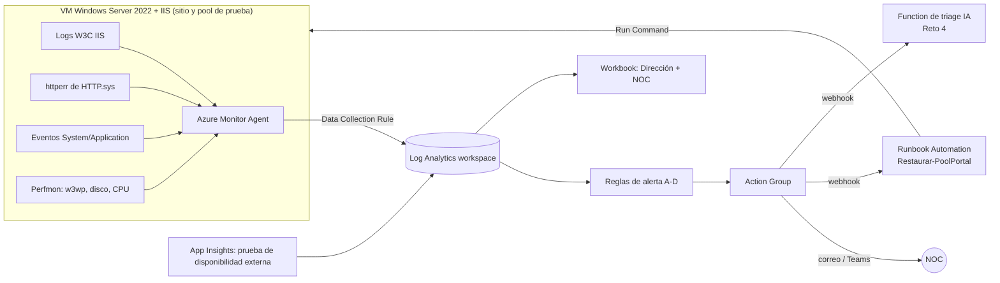

# Reto 3 · Observabilidad y auto-remediación en Azure

> **Estado:** desplegado y probado en Azure el **5-oct-2026** (sección 0), con una adaptación: la suscripción de prueba **no permitió crear la VM** (cuota 0 en familias nuevas y "sin capacidad" en B2s, B2ms, A2_v2 y D2_v2 en eastus2 y centralus; ver `evidencias/00_vm_sin_capacidad.jpg`). Por eso el laboratorio corre en **Azure App Service Windows (IIS administrado)** con una app que reproduce la fuga de `SesionPagoCache`. Las secciones 1–9 son el **diseño objetivo para la VM IIS real** de Andina; lo probado en App Service valida el ciclo completo señal → alerta → correo → auto-remediación → verificación.

## 0. Lo que se desplegó y midió (5-oct-2026)

### Cómo reproducirlo (Azure Cloud Shell, bash)

```bash
# Opción A: clonar (requiere acceso al repositorio)
git clone https://github.com/Fabianps19/prueba-observabilidad-portalpagos.git
cd prueba-observabilidad-portalpagos/reto3-azure && chmod +x *.sh
# Opción B: subir la carpeta reto3-azure comprimida (Cloud Shell → Administrar archivos → Cargar) y descomprimirla
EMAIL=tu-correo@dominio.com ./desplegar.sh   # infraestructura, app, monitoreo, remediación y tablero (~10 min)
source entorno.sh
./simular.sh inicio 128      # "despliega" la versión con fuga y genera tráfico de pagos
./carga.sh resumen $(ls -t carga_*.csv | head -1)   # avance; esperar los ciclos de falla
./simular.sh rollback        # vuelve a la versión sana
./evidencias.sh              # consultas KQL de evidencia y alertas disparadas
az group delete -n "$RG" --yes --no-wait   # al terminar (guardar antes las capturas)
```

Variables opcionales: `RG`, `LOC` (por defecto `centralus`; cambiarla si la suscripción no tiene cupo para App Service B1 allí) y `LAW`. `desplegar.sh` y `remediacion.sh` se pueden ejecutar más de una vez: reutilizan lo que ya existe.

| Pieza | Qué es | Archivo |
|---|---|---|
| Despliegue | Grupo de recursos, Log Analytics, App Service Windows B1 (IIS administrado) y la app; llama a los tres scripts siguientes | `desplegar.sh` |
| App simulada | `pagos.aspx` retiene `FUGA_KB` por operación (0 = sana; con fuga, como la v2.3.1). Al pasar `LIMITE_MB` (600) lanza `OutOfMemoryException` en `SesionPagoCache.Agregar` y **sigue fallando** hasta que alguien reinicie, como el pool del 18-sep. `salud.aspx` = health check | `app/` |
| Monitoreo | Diagnostic settings → Log Analytics (`AppServiceHTTPLogs` = logs W3C de IIS, `AppServicePlatformLogs`, `AppServiceAppLogs`, métricas); Action Group con correo; alertas A–D; Auto-Heal opcional (`AUTOHEAL=true`) | `monitoreo.sh` |
| **Auto-remediación** | Alerta **E** (KQL, sin estado, cada minuto) → Action Group → webhook → runbook de Azure Automation con identidad administrada | `remediacion.sh`, `remediacion/Remediar-PortalPagos.ps1` |
| Tablero | Azure Workbook con una sección para la Dirección y otra para el NOC | `tablero.sh`, `tablero/workbook.py` |
| Falla y evidencia | Tráfico de pagos a ~17 req/s registrado en CSV; consultas KQL (disponibilidad, 5xx, p95, memoria, reinicios, decisiones del runbook) | `simular.sh`, `carga.sh`, `evidencias.sh`, `kql/06_app_service_prueba.kql` |

**Punto 11 en App Service (justificación):** logs de IIS → `AppServiceHTTPLogs` (W3C: estado, URI, `TimeTaken`); eventos de Windows → no se exponen en App Service, se usan `AppServicePlatformLogs` y el registro de actividad (reinicios, cambios de configuración); contadores de rendimiento → métricas de plataforma (`MemoryWorkingSet`, `CpuTime`, `Http5xx`, `HealthCheckStatus`) en `AzureMetrics`. En la VM real sería AMA + DCR (sección 2).

**Alertas** (todas con correo, salvo E que llama al runbook):

| Alerta | Regla | Sev | Para qué |
|---|---|---|---|
| A. Memoria temprana | Memoria del proceso > 250 MB (máx. en 5 min, cada 1 min) | 2 | Ver venir la fuga antes de que falle (en el kit: 16-sep 18:40) |
| B. Errores 5xx | > 20 respuestas 5xx en 5 min (métrica) | 1 | Avisar a una persona de una falla, aunque sea corta |
| C. Health check | `HealthCheckStatus` < 100 % | 1 | Falla sostenida vista desde afuera |
| D. Tasa de error | > 5 % de errores con ≥ 50 peticiones en 5 min (KQL) | 1 | Degradación sostenida |
| **E. Remediación** | ≥ 20 respuestas 5xx en 5 min (KQL, **sin estado**: reevalúa cada minuto) | 1 | **Dispara el runbook** |
| F. Escalamiento | El runbook escribió `ESCALAR` | 1 | Una persona debe intervenir |

**Salvaguardas del runbook** (`Remediar-PortalPagos.ps1`):

| Salvaguarda | Cómo |
|---|---|
| Solo el caso previsto | Regla `E-remediacion-5xx` en estado *Fired* y solo la app de la variable `AppPermitida` |
| Cuándo **no** actuar | Etiqueta `ventana-mantenimiento=true`; el health check ya responde 200; hubo un reinicio hace < 5 min (enfriamiento: la alerta sin estado se repite cada minuto) |
| Límite de intentos | Máximo **2 reinicios en 60 min** (`MaxReiniciosHora`); al tercero **no reinicia y escala**, porque la falla que vuelve no se arregla reiniciando |
| Modo sugerir | `ModoRemediacion=sugerir` registra la acción sin ejecutarla. En producción empezaría así 30 días (Reto 5); en el laboratorio corre en `automatico` |
| Verificación | Tras reiniciar prueba `/salud.aspx` cada 15 s hasta 2 min; si no se recupera, escala |
| Escalar a una persona | El job termina en error con `ESCALAR`; la alerta F envía el correo |
| Trazabilidad | Cada decisión queda como `REMEDIACION {json}` en JobStreams (Log Analytics), en la bitácora del tablero y en el registro de actividad (reinicios) |
| Mínimo privilegio y sin secretos | Identidad administrada con *Website Contributor* solo sobre la app; solo REST, sin credenciales. El URI del webhook (secreto) vive únicamente en el Action Group |

### Prueba 1: Auto-Heal (primera línea, sin runbook)

#### Línea de tiempo (hora Bogotá)

| Hora | Hecho |
|---|---|
| 10:45:00 | "Despliegue" de la v2.3.1 con fuga (`FUGA_KB=64`) e inicio de la carga |
| ~10:49 | La memoria supera 250 MB (métrica: 242 MB a las 10:48, 373 MB a las 10:50) |
| **10:52:57** | **Alerta A (memoria) disparada y correo enviado — 1 min 55 s antes del primer error** |
| 10:54:52–10:54:54 | Memoria > 600 MB: 30 respuestas 500 y 4 conexiones fallidas |
| **10:54:54** | **Auto-Heal recicla el proceso; vuelve a responder 200 (≈ 2 s de falla)** |
| **10:59:04** | **Alerta B (5xx) disparada** — 4 min 12 s después del primer error |
| 11:04:25–11:04:34 | La fuga sigue (la causa no se corrigió): segundo ciclo, 112 respuestas 500, Auto-Heal recupera en ≈ 10 s |
| 11:05:37 | "Rollback" a la versión sana (`FUGA_KB=0`) |
| 11:08:16 | Alerta B dispara por el segundo ciclo (3 min 51 s después del error) |
| 11:05–11:10 | Sin errores hasta el fin de la carga (11:10:57) |

#### Resultados

| Métrica | 18-sep (incidente) | Laboratorio |
|---|---|---|
| Aviso temprano antes de la falla | Ninguno | Alerta A, ~2 min antes (en producción, con la fuga real de ~0,25 MB/op, serían ~2 días: 16-sep 18:40) |
| Detección de la falla (MTTD) | 4 min por ticket de cliente (2 h 14 min de la degradación) | 3 min 51 s – 4 min 12 s por alerta B, sin depender del cliente |
| Recuperación (MTTR) | 26 min, manual | **≈ 2 s y ≈ 10 s, automática** |
| Peticiones fallidas | 1.985 | 146 de 25.585 (142 HTTP 500 + 4 sin conexión) |
| Disponibilidad | 94,476 % el viernes | 99,43 % (cliente) / 99,388 % (logs IIS en Log Analytics) |

#### Lo que no funcionó como esperaba (y por qué)

- **La alerta D (tasa de error > 5 %) no se disparó.** Las fallas duraron segundos: en la ventana de 5 min la tasa quedó en ~0,6 % y ~2 %. Es la misma trampa del NOC: un promedio largo esconde ráfagas cortas. Por eso la alerta B usa un **conteo absoluto** de 5xx, y fue la que avisó. En producción mantendría ambas: B para ráfagas, D para degradación sostenida.
- **La alerta C (health check) tampoco se disparó.** El health check se evalúa cada minuto y la app se recuperó antes. No es un error: significa que la auto-remediación fue más rápida que el chequeo.
- **La alerta B llega en ~4 min** por la latencia de las métricas de plataforma más la ventana de evaluación. La recuperación ya había ocurrido; la alerta sirve de **registro y aviso**, no de disparador. Si la auto-remediación fallara, la B sigue avisando a una persona.
- **Auto-Heal mitiga, no corrige, y no cumple el punto 14:** lo dispara su propia regla (no una alerta), no tiene límite de intentos ni escala a una persona. 10 minutos después la fuga volvió a tumbar la app y solo el rollback la detuvo. Por eso la remediación oficial es el runbook disparado por la alerta E (prueba 2), con límite de 2 reinicios por hora y escalamiento.

### Prueba 2: auto-remediación disparada por alerta (runbook con salvaguardas)

Detalle y capturas: `evidencias/RESULTADOS.md` (sección "Prueba 2"), `evidencias/07`–`09` (runbook) y `evidencias/10`–`12` (tablero).

| Qué se probó | Resultado |
|---|---|
| La alerta dispara el runbook sola | **Sí.** De la primera respuesta 5xx a la ejecución del runbook pasaron de 1 a 3 min |
| Remediación y verificación | **Sí.** En cada falla el runbook reinició y verificó health 200 en 30–60 s (11 reinicios en total, según el tablero). Recuperación total de ~2 a 4 min, frente a 26 min manuales el 18-sep |
| Cuándo no actuar | **Sí.** Con la app sana, cada nueva ejecución de la alerta registró `NO_ACTUA` |
| Trazabilidad | **Sí.** Cada decisión quedó como `REMEDIACION {json}` en la salida de los jobs y en el tablero (49 `NO_ACTUA`, 11 `ACTUA`, 11 `RECUPERADO`) |
| Tablero para Dirección y NOC | **Sí.** Workbook con disponibilidad cada 15 min, decisiones del runbook, 5xx por minuto, p95, memoria y endpoints con error (capturas 10–12) |
| **Límite de intentos y escalamiento** | En la prueba 2 **no**: el contador se perdía (v1 y v2) y el runbook reiniciaba sin escalar. Corregido en la v3 y **verificado en Azure en la prueba 3** (abajo) |

**Observación sobre la métrica de memoria:** en la prueba 2 (128 KB por operación) la memoria de plataforma (`MemoryWorkingSet`) no pasó de ~150 MB, aunque la app fallaba al superar 600 MB de memoria administrada. Hipótesis: los bloques grandes se reservan sin que el sistema operativo los cuente como memoria en uso. Lección: la alerta temprana no debe depender solo de la métrica de plataforma; conviene publicar una métrica propia de la aplicación (tamaño del caché).

### Prueba 3 (6-oct): despliegue desde cero y límite de intentos verificado

Grupo de recursos nuevo, creado con `desplegar.sh` sin intervención manual en **4 min 21 s**. Detalle: `evidencias/RESULTADOS.md` (sección "Prueba 3"). Capturas: 13–18 (despliegue, runbook, alertas y consultas KQL), 19–21 (tablero con las decisiones `ESCALAR`) y 22–23 (presupuesto de USD 10 con alertas al 50 % del costo previsto y al 90 % del costo real).

| Hora (Bogotá) | Hecho |
|---|---|
| 08:46 | Ciclo 1: la app empieza a fallar |
| 08:49 | Alerta B: correo |
| 08:51 | Runbook **ACTUA** (intento 1 de 2) → recuperado en 30 s |
| 08:56 | Ciclo 2: runbook **ACTUA** (intento 2 de 2) → recuperado en 30 s |
| 09:01 | Ciclo 3: la app falla de nuevo |
| **09:05** | Runbook **ESCALAR**: "Ya hubo 2 reinicios en 60 min (límite 2). No se reinicia: la falla vuelve, requiere una persona". La app queda caída a propósito |
| **09:10** | **Alerta F: correo de escalamiento a la persona de turno** |
| 09:13 | La persona interviene: rollback de la versión y reinicio → servicio sano a las 09:14 |

| Salvaguarda | Verificada en Azure |
|---|---|
| Se dispara sola desde una alerta | Sí (pruebas 2 y 3) |
| Cuándo no actuar (app sana, enfriamiento) | Sí (pruebas 2 y 3) |
| **Límite de intentos (2 por hora)** | **Sí (prueba 3)** |
| **Escalar a una persona** | **Sí (prueba 3): runbook `ESCALAR` + correo de la alerta F** |
| Trazabilidad | Sí: cada decisión en la salida de los jobs, en Log Analytics y en el tablero |

**Recursos:** el grupo de recursos se elimina al terminar cada prueba (`az group delete`).

Tiempos en UTC en los logs (Bogotá = UTC-5), igual que en el Reto 1.

**Costo del laboratorio:** App Service B1 (~USD 0,075/h), Log Analytics dentro de los 5 GB gratuitos, Automation dentro de los 500 min gratuitos, 6 reglas de alerta (céntimos). Unas horas de laboratorio: < USD 1. El grupo de recursos se elimina al terminar (`az group delete`). **IaC:** el despliegue es repetible con scripts de Azure CLI; pasarlo a Bicep es el siguiente paso.
## 1. Arquitectura



## 2. Recolección (Azure Monitor Agent + Data Collection Rule)

| Fuente | Configuración en la DCR | Tabla destino | Por qué |
|---|---|---|---|
| Logs IIS W3C | Origen "IIS logs" | `W3CIISLog` | Errores, latencia, tráfico por endpoint |
| **Log de HTTP.sys** (`C:\Windows\System32\LogFiles\HTTPERR\*.log`) | Origen "Custom text logs" con transformación KQL | `HttpErr_CL` | **Lección del Reto 1:** cuando el pool se apaga, los 503 solo quedan aquí. Sin esta fuente, la disponibilidad sale mejor de lo real |
| Eventos de Windows | `System!*[System[(Level=1 or Level=2 or Level=3)]]` y `Application!*[System[(Level=1 or Level=2)]]` | `Event` | WAS 5002/5011, .NET 1026, ASP.NET 1309, disco 2013 |
| Contadores | `\Process(w3wp*)\Private Bytes`, `\LogicalDisk(C:)\% Free Space`, `\Processor(_Total)\% Processor Time`, `\Web Service(_Total)\Current Connections` cada 60 s | `Perf` | La fuga y el disco fueron las señales tempranas |
| Prueba de disponibilidad | App Insights *standard test* cada 5 min desde 3 ubicaciones contra una página que ejecute lógica real (no `/health` estático) | `AppAvailabilityResults` | Ver el portal **desde afuera**, como el cliente |

Se elige AMA + DCR porque el agente anterior (MMA) fue retirado y la DCR permite filtrar en origen (menos costo de ingesta).

## 3. Consultas KQL (`kql/`)

| Archivo | Responde |
|---|---|
| `01_disponibilidad_real.kql` | Disponibilidad real por hora, **sumando los 503 de HTTP.sys** |
| `02_errores_5xx.kql` | Tasa de errores cada 5 min y endpoints afectados |
| `03_latencia_p95.kql` | p95 frente a la línea base de 7 días |
| `04_eventos_pool.kql` | Eventos del pool y de la aplicación, sin el ruido (DCOM, Schannel, SCM) |
| `05_memoria_disco.kql` | Memoria de w3wp y disco libre (señales tempranas) |
| `06_app_service_prueba.kql` y `../evidencias.sh` | **Ejecutadas sobre los datos del laboratorio:** disponibilidad, 5xx por endpoint, p95, memoria, reinicios y decisiones del runbook |

## 4. Alertas

| Alerta | Regla | Severidad | Acción | Por qué este umbral |
|---|---|---|---|---|
| **A. Latencia** (`alerta_A_latencia.kql`) | p95 > 2× la línea base por 15 min con ≥ 100 peticiones / 5 min | Sev2 | NOC + triage IA | Con los datos del kit habría avisado el 18-sep a las **12:00**, 1 h 34 min antes del primer ticket, **sin falsas alarmas** de lunes a jueves |
| **B. Errores** (`alerta_B_errores.kql`) | (5xx + 503) > 5 % en 5 min con ≥ 50 peticiones | Sev1 | NOC + triage IA | El mínimo de peticiones evita alarmas de madrugada por 1 error en 3 peticiones |
| **C. Pool detenido** (`alerta_C_pool_detenido.kql`) | Evento WAS 5002 | Sev1 | **Auto-remediación** + NOC | Es el estado exacto de la caída del 18-sep (14:38) |
| **D. Memoria** (`alerta_D_memoria.kql`) | Private Bytes de w3wp > 1 GB | Sev3 (ticket) | Ticket a desarrollo | Habría avisado el **miércoles 16 a las 18:40**, casi dos días antes |
| E. Disponibilidad externa | Prueba falla en ≥ 2 de 3 ubicaciones | Sev1 | NOC | Detecta caídas totales aunque los logs no lleguen |
| F. Disco | C: < 20 % libre | Sev2 | NOC | El disco se llenaba ~7 GB por día |

Severidades: Sev1 = clientes afectados ahora; Sev2 = degradación o riesgo en horas; Sev3 = riesgo en días. Notificación con un Action Group (correo + canal de Teams del NOC); la URL del webhook se guarda como secreto, no en el código.

## 5. Auto-remediación con salvaguardas (`remediacion/Restaurar-PoolPortal.ps1`)

Escenario: **el pool se detiene** (alerta C). Herramienta: runbook de Azure Automation con identidad administrada, disparado por el webhook del Action Group.

| Salvaguarda | Cómo |
|---|---|
| Solo actúa en el caso previsto | Valida el nombre de la alerta, que esté "Fired" y el pool permitido |
| Cuándo **no** actuar | VM con etiqueta `ventana-mantenimiento = true`; VM sin heartbeat en 5 min (el problema no es el pool) |
| Límite de intentos | Máximo **2 en 60 minutos** por VM; al tercero no actúa y escala (evita reiniciar en bucle una aplicación con fuga) |
| Acción mínima | Inicia **solo el pool**; nunca `iisreset` ni reinicio de la VM |
| Verificación | Tras 20 s revisa el estado del pool y una petición HTTP local; si no se recuperó, escala |
| Escalamiento a una persona | Mensaje al canal del NOC con los datos del intento |
| Trazabilidad | Cada decisión se registra en JSON en la salida del job, enviada a Log Analytics (`AzureDiagnostics`, `JobStreams`) |

El código pasa el analizador sintáctico de PowerShell, pero **no se ejecutó en Azure** (sin VM, ver sección 0). En el laboratorio, la auto-remediación equivalente se probó con Auto-Heal.

**Importante:** reiniciar el pool solo devuelve el servicio. La causa (la fuga) la corrige desarrollo; por eso la alerta D abre un ticket y el triage del Reto 4 sugiere RB-04 (escalar a desarrollo).

## 6. Tablero (Azure Workbook) para dos públicos

| Pestaña Dirección | Pestaña NOC |
|---|---|
| Disponibilidad del mes frente al objetivo (p. ej. 99,5 %) | Tasa de errores y p95 en vivo (últimas 4 h, cada 5 min) |
| Incidentes del mes, MTTD y MTTR | Estado del pool, memoria de w3wp y disco |
| % de incidentes detectados antes que el cliente | Alertas activas y resultado de la última auto-remediación |
| Tendencia semanal en lenguaje de negocio | Eventos clave sin ruido y enlace a las consultas KQL |

## 7. Tiempos esperados de detección y recuperación en la VM (estimados; los medidos en App Service están en la sección 0)

| Escenario | Hoy (18-sep) | Con este diseño (estimado) |
|---|---|---|
| Detección de la degradación | Ticket de un cliente, 2 h 14 min después de empezar | Alerta A: ~15–20 min (15 min de ventana + 2–5 min de ingesta y evaluación) |
| Detección del pool detenido | 4 min (ticket) | Alerta C: ~3–6 min (ingesta del evento + evaluación cada 1–5 min) |
| Recuperación del pool detenido | 26 min (reinicio manual) | ~5–10 min (inicio del runbook + Run Command + verificación) |

## 8. Costo estimado

Aproximado, a validar en la calculadora de Azure; precios de pago por uso en USD.

| Componente | Laboratorio (unas horas) | Producción (mensual) |
|---|---|---|
| VM B2s Windows (~USD 0,09/h) | < USD 2 | No aplica (la VM ya existe) |
| Log Analytics (5 GB/mes gratis, luego ~USD 2,3–2,8/GB) | ~USD 0 | ~USD 10–30 según volumen de logs IIS |
| Reglas de alerta de logs (6) | Céntimos | ~USD 3–9 |
| Prueba de disponibilidad (3 ubicaciones, cada 5 min) | Céntimos | ~USD 1–3 |
| Automation (500 min/mes gratis) | USD 0 | ~USD 0 |

## 9. Cómo lo desplegaría (orden) y qué faltó

1. Grupo de recursos, VM B2s con IIS y un sitio de prueba con una página que consuma memoria a voluntad.
2. Log Analytics + DCR (sección 2) + App Insights.
3. Reglas A–F y Action Group.
4. Cuenta de Automation con identidad administrada (rol *Virtual Machine Contributor* solo sobre la VM), runbook y webhook.
5. Workbook.
6. Prueba: `Stop-WebAppPool` o la página que consume memoria; medir detección y recuperación; video.
7. Todo lo anterior en **Bicep** para poder repetirlo y borrarlo. Siguiente paso, no incluido.
8. **Eliminar el grupo de recursos** al terminar.
